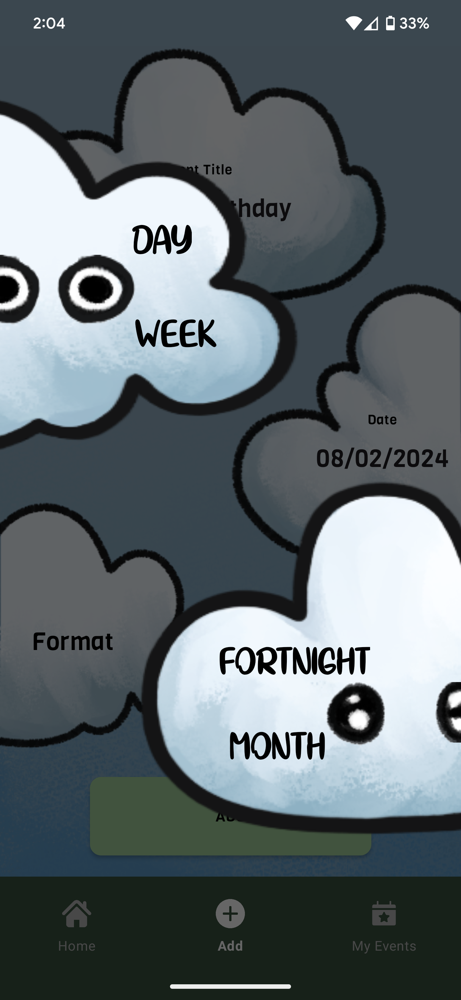

<table>
  <tr>
    <td width="550dp">
      Welcome to Countdown, the definitive app for Android users designed to meticulously track and manage the time left until your significant events. Whether it's a birthday, an anniversary, a project deadline, or any milestone, Countdown offers a sleek and intuitive interface to keep you informed down to the second. With Countdown, every event is organised and accessible, ensuring you're always prepared for what's ahead.
    </td>
    <td>
      
    </td>
  </tr>
</table>

## Features

- **Multiple Time Formats**: View time left in days, weeks, fortnights, or months to suit your preference.
- **Home Page Event Overview**: Instantly see your nearest upcoming event upon opening the app.
- **Effortless Event Addition**: Easily add new events with details and choose your preferred countdown format.
- **Comprehensive Event Management**: View and manage your events, edit details, or remove them as needed.
- **Dynamic Countdown Display**: Select any event to view an expanded countdown in your chosen format, with options to switch between formats.
- **Dark and Light Mode**: Customize your app experience with a dark and light mode, changing the entire interface's theme.

## Screenshots

Get a closer look at Countdown in action with these screenshots:

**Home Screen - Your closest event and quick access to features.**

  
  

**Add Event Screen - Simplified event entry.**

  
  

**Choose Format Screen - Pick your format to save**

  
  

**My Events Screen - Overview of all your events.**

  
  

**Countdown Detail Screen - See detailed countdowns and view multiple formats**

  
  
  
  

## Getting Started

### Installation

1. Visit the Google Play Store and search for "Countdown." [https://play.google.com/store/apps/details?id=com.indyinc.countdown]
2. Download and install the app onto your Android device.
3. Open the app to begin tracking your events.

### Requirements

- Android 9.0 or higher.
- No internet connection is required for basic functionality but may be needed for initial setup and updates.

## Usage

### Home Screen

- **Overview**: View your closest event right from the start.
- **Change Format Viewed**: Tap buttons at the top to changes the format for the countdown.

### Add Event Screen

- **Event Details**: Enter your event's title, date, and choose your countdown format.
- **Add Event**: Tap "Add" to add the event to your .

### My Events Screen

- **View and Manage**: See all your events, and remove them as needed.
- **Countdown and Format Selection**: Click on any events to see the countdown and select the format to view.

### Event Detail Screen

- **Countdown Display**: View an expanded countdown in your chosen format.
- **Format Switching**: Easily switch between day, week, fortnight, and month views.

## Support

Encounter an issue or have a suggestion? We value your feedback:

- **Contact Us - FAQs and Troubleshooting**: [indyshivy@gmail.com]

## Updates

Keep your app updated for the latest features and an ever-improving experience. Follow us on the Google Play Store and enable updates for Countdown.

## Credits

Countdown is proudly developed by me (Indy) and published by IndyInc. A special thanks to our users for their invaluable feedback and support.

## Copyright and Acknowledgements

Countdown is created for personal use and is not affiliated with any external services. All data is stored locally on your device unless otherwise specified by the user.
Thank you for choosing Countdown as your go-to event tracking app! 
